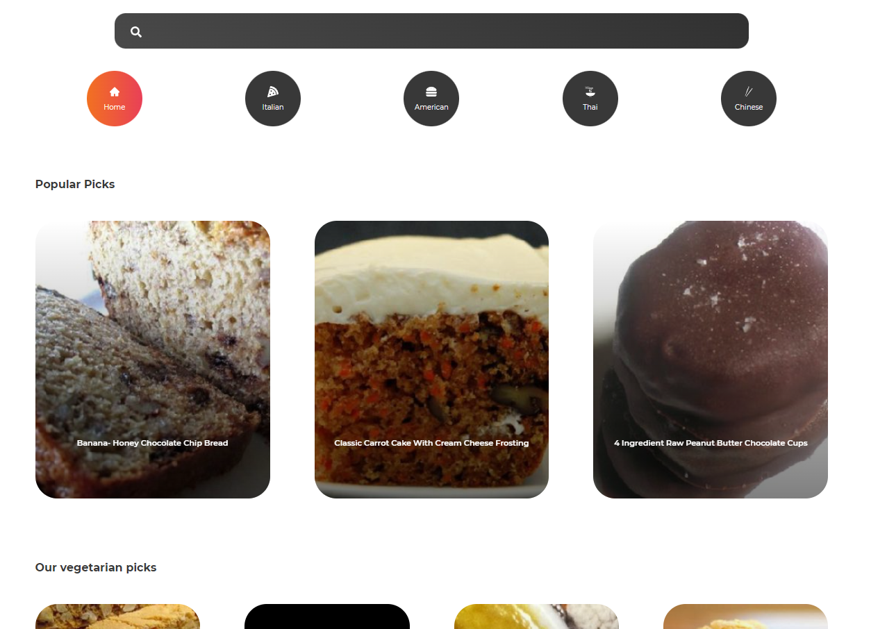
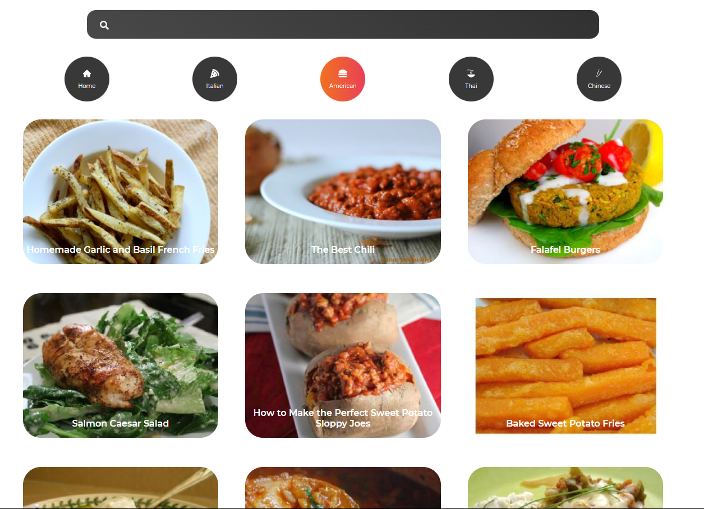
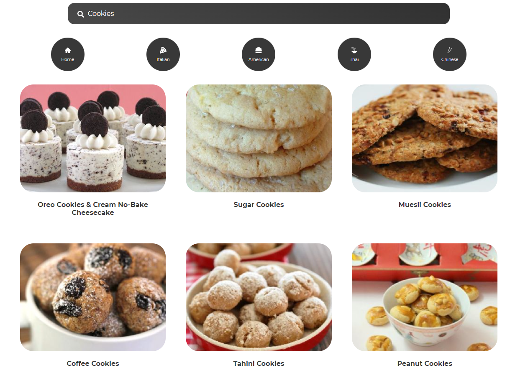
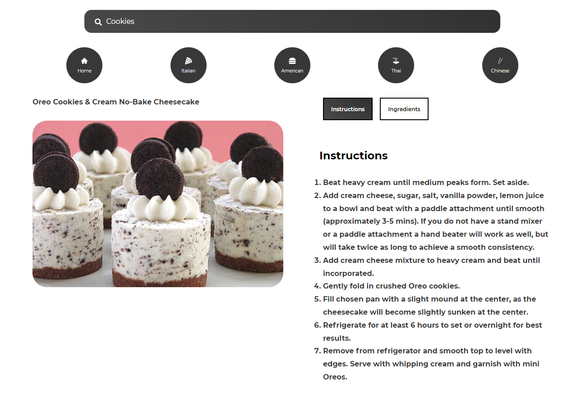
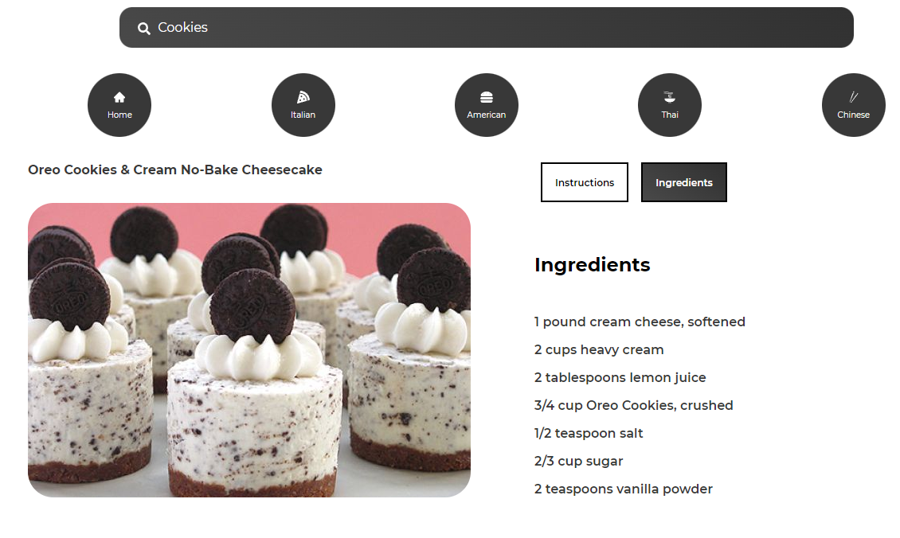

<h1>Recipes App con ReactJS</h1>
 
<h2>Funciones:</h3>
<ul>
  <li><h4>Visualización de las recetas mas populares, incluyendo un apartado vegetariano</h4></li>
  
   
  <li><h4>Acceso a diferentes menús segun el país elegido.</h4></li>
  
    
  <li><h4>Búsqueda personalizada de recetas.</h4></li>
  
    
  <li><h4>Detalle de cada receta.</h4></li>
   
    
    
</ul>
 
<h3>Conceptos aplicados:</h3>
<ul>
  <li><h4>Fetch API</h4></li>
  <li><h4>Styled-Components</h4></li>
  <li><h4>React Hooks</h4></li>
  <li><h4>React Splide</h4></li>
</ul>

